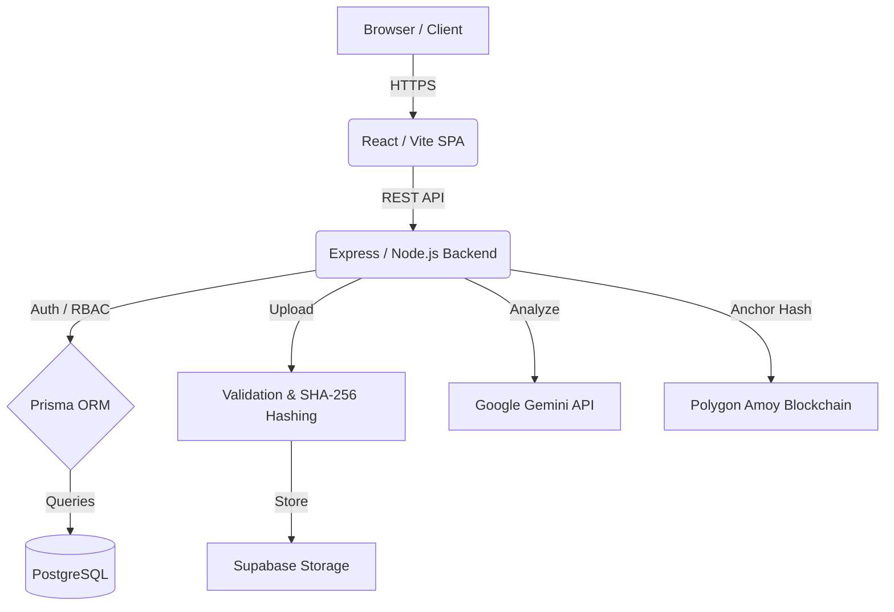

# LegalProof AI
### Secure Digital Evidence & Complaint Management System

LegalProof AI is an actively developed academic/portfolio software project with a production-oriented architecture for managing digital complaints, cases, and evidence. It features strict chain-of-custody tracking, cryptographic hash verification, AI-assisted investigation, and role-based access control.

[](#)
[](#)
[](#)
[](#)

Overview • Features • Architecture • Workflow • Security • Setup • Tech Stack • SDG Alignment

---

## Live Demo

**Deployment URL:** [https://legalproof.ai.studio](https://legalproof.ai.studio)  
*(Please note: Demo instances may have restricted administrative features and temporary data persistence).*

---

## Why LegalProof AI?

Managing digital complaints and evidence securely is challenging. Organizations struggle with fragmented chain-of-custody, weak role-based workflows, and questionable evidence integrity.

LegalProof AI addresses these challenges by providing a structured, secure platform where complaints are triaged efficiently, evidence integrity is mathematically verified via SHA-256 hashing, and high-stakes operations are controlled by strict Role-Based Access Control (RBAC).

## Core Value Proposition

**Complaint → Review → Escalation → Case → Assignment → Evidence → Verification → AI Analysis → Blockchain Anchor → Audit Trail**

LegalProof AI ensures that every piece of digital evidence is verified, securely stored, and tracked throughout its lifecycle. To add an extra layer of transparency, evidence hashes (not the private files themselves) can be anchored to the public Polygon Amoy blockchain.

## Key Features

### Secure Case Management
- Complaint submission and tracking
- Investigator triage workflows
- Escalation from complaints to formal cases
- Investigator case assignment requests and admin approvals
- Role-based case access restrictions

### Digital Evidence Integrity
- SHA-256 cryptographic hashing upon upload
- File type and magic-byte validation
- Secure, private evidence storage via Supabase Storage
- Immutably recorded chain-of-custody logs
- Evidence lifecycle and verification controls

### AI-Assisted Investigation
- Authorized, server-side Google Gemini analysis
- Restricted analysis tied to verified evidence
- Auditable analysis execution logs
- Investigator/admin execution authorization

### Blockchain Verification
- Hash-only blockchain anchoring on Polygon Amoy
- Transaction receipt and block tracking
- Public, independent verification workflows
- Smart contract integration via ethers.js

### Security First
- JWT authentication & bcrypt password hashing
- Granular RBAC (Complainant, Investigator, Admin)
- Security headers (Helmet) & Rate limiting
- Strict payload validation (Zod)
- CORS restrictions
- IDOR (Insecure Direct Object Reference) protection

---

## End-to-End Workflow

1. **Registration:** Complainants register securely via the platform.
2. **Submission:** A digital complaint is submitted with supporting proofs.
3. **Triage:** Investigators review and triage the complaint.
4. **Escalation:** The complaint is formally escalated into an active case.
5. **Assignment:** Investigators request assignment; Admins approve/reject.
6. **Casework:** Assigned investigators manage the formal case and review materials.
7. **Evidence:** Formal digital evidence is uploaded, hashed, and verified.
8. **AI Analysis:** Authorized investigators run AI-assisted analyses on evidence.
9. **Anchoring:** Evidence hashes are securely anchored to the Polygon Amoy blockchain.
10. **Verification:** Public users can independently verify the hash against the blockchain.
11. **Audit:** Every critical action is recorded in the auditable chain-of-custody records with restricted modification paths.

---

## Role-Based Access Model

| Role | Main Responsibilities |
|------|-----------------------|
| **Complainant** | Submit complaints, monitor status, and manage initial supporting proofs. |
| **Investigator** | Triage complaints, request case assignments, work assigned cases, manage evidence, and execute authorized AI/blockchain actions. |
| **Admin** | Platform oversight, assignment approvals, investigator management, and security/audit oversight. |

---

## Security Architecture

LegalProof AI implements a defense-in-depth approach:
- **Authentication:** Standard JWT-based auth flows with securely hashed (bcrypt) credentials.
- **Authorization:** Strict RBAC limits data access (e.g., Complainants cannot access raw Case evidence).
- **Validation:** Zod schemas validate all inbound API requests.
- **Network Security:** Helmet secures HTTP headers, express-rate-limit prevents abuse, and strict CORS policies control cross-origin requests.
- **Storage:** Sensitive evidence is stored in private Supabase Storage buckets, heavily restricted from public access.
- **Integrity:** SHA-256 hashing guarantees evidence hasn't been tampered with since upload.

---

## Architecture

The platform follows a modern full-stack architecture running a React SPA against a secure Express/Node API, powered by a PostgreSQL database via Prisma ORM.



---

## Technology Stack

| Category | Technologies |
|----------|--------------|
| **Frontend** | React 19, TypeScript, Vite, Tailwind CSS, shadcn/ui, motion |
| **Backend** | Node.js, Express, TypeScript |
| **Database** | PostgreSQL, Prisma ORM |
| **Storage** | Supabase Storage |
| **AI** | Google Gemini (`@google/genai`) |
| **Blockchain** | Polygon Amoy, ethers.js, Hardhat |
| **Security** | JWT, bcrypt, Helmet, express-rate-limit, Zod |

---

## Project Structure

```text
legalproof-ai/
├── client/           # React frontend (Vite, Tailwind, Pages, Components)
├── server/           # Express backend (Controllers, Routes, Middleware, Services)
├── prisma/           # Database schema and migrations
├── blockchain/       # Hardhat project for smart contracts
├── scripts/          # Helper scripts (Setup, Seeding)
├── .env.example      # Environment variable template
├── package.json      # Monorepo dependencies and scripts
└── README.md         # Project documentation
```

---

## Easy Setup (One-Command)

LegalProof AI includes a safe, cross-platform setup utility to get you started quickly.

### Prerequisites
- Node.js 18+
- PostgreSQL database

### 1. Clone & Install
```bash
git clone <repository-url>
cd legalproof-ai
npm install
```

### 2. Run Setup
```bash
npm run setup
```
*This command safely verifies your Node.js version, creates a `.env` file (if one doesn't exist) without overwriting your credentials, and generates the Prisma client.*

### 3. Configure Environment
Open the newly created `.env` file and set up your `DATABASE_URL` (PostgreSQL) and other required secrets.

### 4. Database Setup & Start
```bash
npx prisma db push
npm run dev
```

---

## Environment Variables

| Variable | Description | Required |
|----------|-------------|----------|
| `NODE_ENV` | Environment mode (`development` or `production`) | Yes |
| `DATABASE_URL` | PostgreSQL connection string | Yes |
| `JWT_SECRET` | Secret key for signing JWT tokens | Yes |
| `GEMINI_API_KEY` | Google Gemini API Key for AI Analysis | Optional* |
| `BLOCKCHAIN_RPC_URL` | RPC URL for Polygon Amoy | Optional* |
| `BLOCKCHAIN_PRIVATE_KEY` | Wallet Private Key for anchoring | Optional* |
| `SUPABASE_URL` | Supabase Project URL | Optional* |
| `SUPABASE_SERVICE_ROLE_KEY` | Supabase Service Role Key | Optional* |

*\*Optional depending on which features (AI, Blockchain, Storage) you are testing locally.*

---

## Development Commands

- `npm run setup` — Safely initialize the environment and generate Prisma client.
- `npm run dev` — Start the combined frontend/backend development server.
- `npm run build` — Build the production React assets and bundle the Node.js server.
- `npm run start` — Run the production built server.
- `npm run lint` — Run TypeScript type checking across the codebase.
- `npm run seed:investigator` — Safely provision a local-only demo investigator account.

---

## Deployment

LegalProof AI is designed for containerized deployment (e.g., Google Cloud Run, Docker).
1. The `npm run build` command generates static frontend files and a bundled backend file (`dist/server.cjs`).
2. The `npm run start` script serves both API endpoints and static frontend assets securely.
3. Production instances require robustly configured environment variables (including remote Supabase Storage configurations and live PostgreSQL credentials).

---

## Sustainable Development Goal Alignment

### SDG 16 — Peace, Justice and Strong Institutions
LegalProof AI aligns with SDG 16 by promoting accountable digital complaint handling and transparent evidence workflows. The platform ensures that critical evidence is securely stored, immutably tracked, and responsibly analyzed, thereby supporting the establishment of effective, accountable, and transparent institutions.

---

## Limitations / Responsible Use

- **Decision Support Only:** LegalProof AI is a technical evidence and case management system. AI-assisted analysis is designed for decision support and is **not** a substitute for qualified human or legal judgment.
- **Hash Verification:** Blockchain anchoring verifies the recorded cryptographic hashes of files at a specific point in time; it does not independently verify the underlying truth or authenticity of the evidence itself.
- **Compliance:** Production use should strictly follow applicable local laws, organizational policies, privacy requirements, and formal evidentiary procedures.
